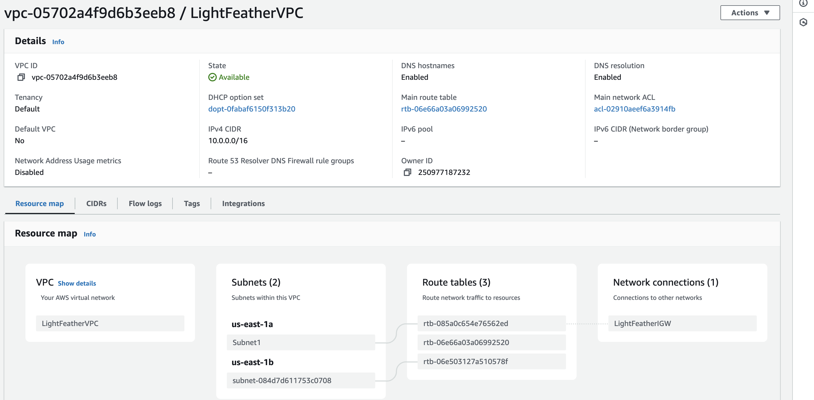

# Overview
This repository contains a React frontend, and an Express backend that the frontend connects to.

# Objective
Deploy the frontend and backend to somewhere publicly accessible over the internet. The AWS Free Tier should be more than sufficient to run this project, but you may use any platform and tooling you'd like for your solution.

Fork this repo as a base. You may change any code in this repository to suit the infrastructure you build in this code challenge.

#   Requirement for the project
+   AWS Services:- IAM, ECR, ECS, EC2 instances for the jenkins
+   Docker
+   Github action
+   Terraform
+   Nodejs dependencies (node version 16)

# Running the project
The backend and the frontend will need to run on separate processes. The backend should be started first.
```
cd backend
npm ci
npm start
```
The backend should response to a GET request on `localhost:8080`.

With the backend started, the frontend can be started.
```
cd frontend
npm ci
npm start
```
The frontend can be accessed at `localhost:3000`. If the frontend successfully connects to the backend, a message saying "SUCCESS" followed by a guid should be displayed on the screen.  If the connection failed, an error message will be displayed on the screen.

#   Task 1: Dockerization of both application (frontend and the backend) on our local machine
##  Backend application:
+   To dockerize the backend application, we can simply use **docker init** command to create a Dockerfile, .dockerignore, compose.yaml and a Readme file. 
+   The main Dockerfile for the backend application can be [here](./backend/Dockerfile)
+   We can spin up the docker container using the command

        docker compose up
+   Then we get to access the application at the url http://localhost:8080


##  Frontend application
+   We can also go with the command **docker init** to help create our dockerfile and othe related files and putting in place best practices.
+   After the successful creation of the [Dockerfile](./frontend/Dockerfile), we can then spin up the docker container using the command

        docker compose up
+   We can also access the frontend application at the url path http://localhost:3000


+   **NB**: We have both container running simultaneosly for the frontend and the backend to connect to each other. We can also notice we have thesame 'id value' from both screenshot above which shows they both connect.
    
#   Task 2: Creating an automated Github action to deploy both frontend and backend application to Elastic Container Registry (ECR)
+   I utilized the GitHub action for the CI/CD for seamless integration and to demonstrate the workflow in a more visual format. Also, since am hosting my codebase on GitHub, it makes it easier to set up and work on.

##  A- GitHub Action pipeline
+   Pipeline for building, starting, dockerizing and pushing to Elastic Container Registry (ECR) - For this, i made sure the application builds and starts properly before dockerizing and pushing to ECR. The buildng of the app to docker image solely depend on application running and starting properly


+   Updated image on Elastic Container Registry (ECR)


##  B - Versioning Strategy
+   Using the versioning strateegy, i have made the docker image to have two tags (latest and a random value), in any occurence where we need to roll back to previous image, we can use the random value tag because the latest tag will be replaced each time we push to ECR.

##  C - Git Hooks
+   This is been implemented anytime there is a push to the repo, it then trigger the pipeline to start running.

        on:
        push:
            branches:
            - main


#   Task 3: Terraform Setup
This repository contains Terraform scripts to provision AWS resources. The scripts are organized to achieve the following tasks:

##  A- Terraform Setup
##  1.  Create VPC, Subnets, and ECS cluster, ECS service and deployed the application to ECS Service

### Prerequisites
+   [Terraform](https://developer.hashicorp.com/terraform/install) installed on your machine.
+   AWS credentials configured with appropriate permissions.

### Steps
1.  Clone this repository:

        git clone <current-github-url>
        cd terraform

2.  Initialize Terraform:

         terraform init
3.  Plan Terraform:

         terraform plan
4.  Apply Terraform:

        terraform apply

5.  Destroy the resources

        terraform destroy

##  Detail Explanation On How The Terraform Flow Execute
1.  Firstly, the terraform created the VPC resources to deploy our application, it is best create a new VPC for production and not to use the default VPC. The below VPC contains 2 Subnets, internet gateway and route table


2.  After, we created the security group to attach our ecs services, this opens the port 3000 and 8080 [here](./terraform/seg.tf)


3.  We then deployed ECS cluster task defination, task definition role and ecs service for the backend application [here](./terraform/backend_ecs_setup.tf)
    +   backend task definition
        

    +   backend service
        

    +   The application by heading to the URL http://<public_ip_of_backend_service>:8080/, in my case http://18.234.69.52:8080/
        
    
4.  Before we can make our frontend to connect with the deployed backend application, we need to change url this path [here](./frontend/src/config.js) to include our newly deployed url, because we are not more in our local system we are now running the application on the cloud.

            Before runnning on cloud, this is our local machine
        //  export const API_URL = 'http://localhost:8080/'

            After the backend application is being deployed to the cloud, we need to change from **localhost** to **backend public ip in ecs service**
            export const API_URL = 'http://18.234.69.52:8080/'
            export default API_URL

    +   If the configuration is not done as above then we get this error
        
5.   After the change, i push this to the github so the github action can do the contineous integrate and update the image with the latest application configuration.

6.   We can then deploy our terraform script for the frontend application, which does the same thing as the backend applicatiion
    
+   Frontend task definition
    

    +   Backend Service
    
    
    +   The application by heading to the URL http://<public_ip_of_frontend_service>:3000/, in my case http://54.167.250.149:3000/
    

    +   NB: The public IP for the frontend application get to change subsequently when we push to github and updates the ecr images, it then tends to update the cluster with the new image, so it might change, solution to this is by attaching a static Ip with the service

7.  Lastly, we can destroy the infrastructure on terraform using

        terraform destroy
##  Take away
### Monitoring and Logging
+   In my setup, i utilized the aws cloudwatch logs for the logging and also cloud watch to monitor the resouces such as CPU utilization, memory utilization and other in our environment.